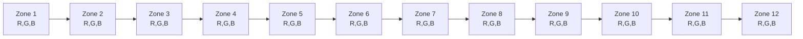

# DMX Lighting Patterns for DJ and Rave Dance Events

## Executive summary

DMX512 lighting for DJ/rave contexts is best approached as a small set of reusable “motion + color + intensity + atmosphere” primitives, combined into beat-synchronous macros that scale from a single 512‑channel universe to multi-universe rigs. Key engineering constraints are: (a) DMX is an 8‑bit slot stream with a START Code and up to 512 payload slots per packet and is widely implemented over an EIA‑485 (RS‑485) physical layer; (b) the protocol (and common IP transports like sACN) does **not** guarantee delivery/acknowledgement, so designs for hazardous outcomes must include independent safety controls. citeturn25view1turn28view3turn25view3

This report first normalizes fixture control into a “fixture attribute schema” (dimmer, shutter/strobe, pan/tilt, pixel RGB, etc.) grounded in manufacturer DMX charts. It then surveys effect engines and libraries (console FX engines, DJ‑sync software, and built‑in fixture macros). Finally, it proposes 12 new, implementable pattern macros tuned to dance music phrasing, each expressed as beat-synced logic with explicit DMX channel usage and a 512‑slot example universe patch. Primary control examples are drawn from manufacturer documentation published by entity["company","Martin Professional","lighting manufacturer"], entity["company","Chauvet DJ","lighting manufacturer"], entity["company","ADJ","lighting manufacturer"], and entity["company","Elation Professional","lighting manufacturer"]. citeturn31view0turn19view0turn20view0turn10view0turn23view1turn22view0turn31view1

## Fixture and DMX channel taxonomy

### Typical channel groupings by fixture type

Most DJ/rave rigs can be modeled with a small number of attribute groups:

- **Intensity group:** dimmer (often 0–255), sometimes dimmer fine (16‑bit), plus shutter/strobe with “open/closed/strobe/pulse/random” regions. citeturn19view0turn23view1turn11view0  
- **Movement group (moving heads / lasers):** pan/tilt (often with fine channels), plus speed/macros. citeturn18view0turn9view0  
- **Color group:** RGB/RGBW/RGBAW+UV intensities (pars/pixels), or color wheel indices/macros (spots). citeturn11view0turn18view0turn20view0turn31view0  
- **Beam FX group (spots/washes/hybrids):** gobo wheel + shake regions, gobo rotation/indexing, prism, focus/zoom, and fixture macro channels. citeturn18view2turn19view0  
- **Pixel/zone group (bars/strips):** repeated RGB triplets per zone/cell; higher-channel modes expose more zones/cells. citeturn20view1turn31view2  
- **Atmosphere group (fog/haze):** output rate + fan/blower and (for some fog jets) color/strobe for integrated LEDs. citeturn21view1turn22view0  

### Concrete examples of “typical” DMX modes

The table below summarizes **typical** channel layouts that show up repeatedly across brands and fixture classes (exact ordering varies; always patch via a fixture profile when available).

| Fixture type | Typical DMX mode sizes | Typical channels (high-level) | Example evidence |
|---|---:|---|---|
| Moving head spot/profile | 8–30+ | Pan/Tilt (+fine), speed; color wheel; gobo + rotation; prism; focus; dimmer; shutter/strobe; control/reset/macros | 14‑ch example includes Pan/Fine Pan/Tilt/Fine Tilt, color wheel, gobo wheel, gobo rotation, prism, focus, dimmer, shutter, control functions, movement macros citeturn18view0turn18view2turn19view0 |
| Moving head wash | 14–40+ | Pan/Tilt; dimmer; strobe; RGBW or CMY mixing; zoom; macros | RGBW mixing mapped to DMX channels 4–7 in one wash example citeturn31view0 |
| LED PAR (RGBAW+UV) | 6–12+ | R,G,B,W,A,UV; master dimmer; strobe; program/select/speed in advanced modes | 8‑ch mode shows R,G,B,W,A,UV + master dimmer + strobe ranges citeturn11view0 |
| Dedicated strobe | 1–4 | rate/speed; intensity/dimming (sometimes duration) | 2‑ch example: flash speed + flash dimming citeturn6view2 |
| Laser projector (DMX) | ~10–20 | mode select; strobe/on; pattern select; zoom; axis rotations; pan/tilt; scan speed | 10‑ch example enumerates control mode, strobe, pattern, zoom, XYZ rolling, pan/tilt, scan speed citeturn9view0 |
| LED bar / pixel bar | 3–36+ | low modes: RGB + dimmer + macros; high modes: RGB per zone/cell | 36‑ch mode shows 12 zones × RGB triplets citeturn20view1 |
| Pixel-mapped strip / multi-cell bar | 16–80+ | per-cell RGB(A…) + dimmer/strobe/effects, often many personalities | Multi-cell fixture shows modes up to “Raw 6 Cell” at 82ch citeturn31view2 |
| Blinders | 1–12+ | master dimmer; per-cell white; strobe; auto/pattern; sometimes CCT/color library | 8‑ch example includes dimmer, two white channels, strobe, auto programs, etc. citeturn23view1 |
| Haze machine | 1–3 | fan/blower + haze output | 2‑ch example: blower speed + haze volume citeturn21view1 |
| Fog / fog jet with LEDs | 1–7+ | fog output; RGB(A) for nozzle LEDs; strobe; master dimmer | 7‑ch example includes fog + RGBA + strobe + master dimmer citeturn22view0 |

### DMX and universes as an engineering boundary

DMX512‑A defines packets with a START Code and up to 512 data slots; it is widely carried over EIA‑485 wiring and is a “single transmitter → many receivers” stream (not a reliable command/ack protocol). citeturn25view1turn28view3  
If you transport DMX over IP, **sACN (E1.31)** and **Art‑Net** are both common, and (like DMX) they are designed for streaming control data without delivery guarantees; sACN explicitly notes non‑reliable transport/no acknowledgement. citeturn25view3turn25view2  

## Existing pattern libraries and common effect primitives

### Where “pattern libraries” actually live

Most real-world libraries come from three places:

1) **Console FX engines (programmable, reusable, phase/spread aware).**  
Lighting consoles implement effects as step/shape engines that can be stored as cues/presets and spread across fixture groups. For example, entity["company","MA Lighting","lighting console manufacturer"] documents “Phasers” as its effect engine, built from Steps that loop through dynamic output. citeturn27view0  
Similarly, entity["company","Avolites","lighting console manufacturer"] describes “Key Frame Shapes” as sequences of attribute settings that fade between frames and can be spread across fixtures (conceptually like a chase with more control). citeturn27view1  

2) **DJ‑sync lighting software and “auto‑scripted” scenes.**  
DJ-focused lighting packages emphasize phrase/beat synchronization and fallback “loops” for un-scripted tracks. entity["company","SoundSwitch","dmx dj lighting software"] describes synchronized lighting to DJ performance and “Autoloops” of configurable bar lengths with an autoscripting workflow, plus integration paths such as Ableton Link/MIDI clock. citeturn27view4turn27view2turn27view5  

3) **Fixture‑internal macros and sound-active programs (fast results, less deterministic).**  
Many fixtures expose internal chase/pulse/sound-active programs via DMX “program” channels. Example: one pixel bar exposes pulse effects, chase programs, and sound-active mode via an Auto Programs channel. citeturn20view0  
Moving heads may provide movement macros and even sound-active movement selections on a dedicated macro channel. citeturn19view0  
This is the core trick for “small controller, big show”: orchestrate multiple fixture-internal engines with a single beat clock.

### Common effect primitives in DJ/rave use

Across ecosystems, the most-used primitives are:

- **Chases** (step sequences, often with phase spread across fixtures). citeturn27view0turn27view1  
- **Waves** (continuous phase offsets; sine/saw/ramp), especially for movement, dimmer, and pixel zones. citeturn31view2turn27view0  
- **Pulses and strobe bursts** (gated intensity; multi-rate strobing regions common on shutter channels). citeturn19view0turn23view1turn11view0  
- **Color sweeps** (palette morphs, wheel scrolls, or RGB fades). citeturn18view0turn11view0  
- **Pixel mapping** (per-zone/per-cell RGB addressing; often 3×N channels). citeturn20view1turn31view2  
- **Sound-to-light** (either fixture internal sound-active modes or software-level beat/phrase detection). citeturn20view0turn27view5  

Because “drop moments” matter most in dance floors, practical libraries also include **blackout-reposition tricks** and **macro layers** (e.g., blackout while pan/tilt moving). citeturn19view0  

## Novel pattern macros tailored to DJ and rave contexts

### Reference universe patch and channel map used in examples

All patterns below are specified against a **single 512‑slot universe** with these sample start addresses (edit as variables for your rig):

- **MH1..MH4** (moving heads) in **14‑ch** mode: bases **1, 15, 29, 43**. 14‑ch example mapping includes Pan/FinePan/Tilt/FineTilt/Speed/Color/Gobo/GoboRot/Prism/Focus/Dimmer/Shutter/Control/Macro. citeturn18view0turn18view2turn19view0  
- **PAR1..PAR8** in **8‑ch** mode: bases **61, 69, 77, 85, 93, 101, 109, 117**. 8‑ch includes R,G,B,W,A,UV, MasterDim, Strobe. citeturn11view0  
- **PIX1..PIX2** (pixel bars) in **36‑ch** mode: bases **129, 165**, using **12 zones × RGB triplets**. citeturn20view1  
- **BLD1** (blinder) in **8‑ch** mode: base **205** (dimmer, W1, W2, strobe, auto programs, etc.). citeturn23view1  
- **STR1** (strobe) 2‑ch: base **215** (speed, dimming). citeturn6view2  
- **LAS1** (laser) 10‑ch: base **219** (mode, strobe, pattern, zoom, XYZ roll, pan/tilt, scan speed). citeturn9view0  
- **HAZE** 2‑ch: base **231** (blower, haze volume). citeturn21view1  
- **FOG** 7‑ch: base **235** (fog + RGBA + strobe + dimmer). citeturn22view0  

Notation: `u[n]=v` means set DMX slot `n` (1–512) to value `v` (0–255). Beat duration is `beat = 60/BPM`.

### Pattern set

**Pattern A — Kick-Lock Blinder Gate**  
BPM: 118–150. Intent: make the kick feel “heavier” without constant strobe fatigue; emphasizes 4‑on‑the‑floor with controllable decay.  
DMX mapping: uses `BLD1` (dimmer + W1/W2), optional `PAR*` master dimmers for “afterglow.” citeturn23view1turn11view0  
Example sequence (per beat):
```text
on each kick (beats 1,2,3,4):
  u[205]=255        # BLD1 Dimmer
  u[206]=255        # W1
  u[207]=255        # W2
  wait 0.10*beat
  ramp u[205] 255→0 over 0.40*beat   # decay tail
  set u[206]=0; u[207]=0
```
Beat-sync: trigger on kick markers (or quarter-note clock).  
Variations/intensity controls:  
- `I` (0–1): scale `255*I`; clamp to keep eyes comfortable.  
- `Tail` (0.1–0.8 beat): longer tails for slower/“melodic” sections.  
Prereqs: one blinder (multi-cell preferred), optional pars for footer glow.

**Pattern B — Offbeat UV Skank With Alternating Warmth**  
BPM: 120–134. Intent: offbeat “bounce” for house/tech-house; pairs UV hits with warm-white “answer” to keep skin tones readable.  
DMX mapping: `PAR*` UV + master dimmer + strobe; optional `PIX*` zone accents. citeturn11view0turn20view1  
Example:
```text
for each bar (4/4):
  offbeats (the “&” of each beat):
    set PAR odd: UV=200, MasterDim=220, Strobe=80
    set PAR even: W=80,  MasterDim=180, Strobe=0
    hold 0.20*beat; then return dims to 0
```
Variations: swap UV↔Amber for “sunset skank”; use PIX zones 1–3 as a small offbeat underline.  
Prereqs: RGBAW+UV pars (or RGB+UV), controller able to address at least 8 pars × 8ch.

**Pattern C — Drop Inversion Blackout Pivot**  
BPM: any (designed around 8–16 bar build → drop). Intent: hide aggressive repositioning so the drop “appears” instantly aligned.  
DMX mapping: `MH*` dimmer + shutter + pan/tilt + control/macro channel for blackout-while-moving; then release on drop. citeturn19view0turn18view2  
Example (last 2 beats before drop):
```text
t = -2 beats:
  u[MH*.Dimmer]=0
  u[MH*.Control]=10     # pick a blackout-while-moving range (fixture-specific)
  move MH pan/tilt to new focus points over 2 beats
t = drop (beat 1):
  u[MH*.Control]=0      # disable blackout macro
  u[MH*.Shutter]=6      # open
  u[MH*.Dimmer]=255
```
Beat-sync: transition tied to phrase boundary (typically 8/16 bars).  
Variations: also preselect gobo + prism during blackout; invert color palette between build and drop. citeturn18view2turn19view0  
Prereqs: moving heads with macro/control channel that supports blackout-on-move (common on spots). citeturn19view0  

**Pattern D — Helix Phaser With Prism Punctuations**  
BPM: 126–150. Intent: “classic rave beam geometry” that reads as a 3D helix in haze; punctuate snares with prism.  
DMX mapping: `MH*` pan/tilt (with phase offsets), dimmer, prism, shutter. citeturn18view0turn18view2  
Pseudo-logic:
```text
continuous:
  pan = center + amp * sin(2π * t / (4 beats) + phase_i)
  tilt= center + amp * cos(2π * t / (4 beats) + phase_i)
  dimmer = 180
on snare (beats 2 and 4):
  prism=on for 0.25 beat, dimmer→255
```
Intensity controls: `Amp` (movement size), `Spread` (phase spacing), `PrismPunch` (snare emphasis).  
Prereqs: 3–8 moving heads, haze.

**Pattern E — Pixel “Bassline Conveyor”**  
BPM: 124–140 (works best when bassline is steady). Intent: a pixel bar becomes a moving bass conveyor belt; kick advances the “belt.”  
DMX mapping: `PIX1` 12 zones × RGB (36ch). citeturn20view1  
Example (zone index `z` advances each kick):
```text
on each kick:
  z = (z % 12) + 1
  set zone z:   RGB=(0,255,220)     # neon teal
  set zone z-1: RGB=(0,80,60)       # tail
  set others:   RGB=(0,0,0)
```
Variations: make two conveyors in opposite directions on PIX1/PIX2; map color to key (palette selection).  
Prereqs: pixel bar/strip with individual zones exposed.

**Pattern F — “Clap Ladder” With Two-Speed Phase**  
BPM: 128–150. Intent: create the illusion of a rising ladder on claps while leaving kicks cleaner.  
DMX mapping: `PIX*` zones + optional `PAR*` low-level wash. citeturn20view1turn11view0  
Example:
```text
on each clap (often beat 2 & 4 or offbeat, genre dependent):
  for step k=1..6 (over 0.5 beat):
    light zone (2k-1) to 255, zone (2k) to 120, others 0
```
Controls: `Steps` (3–12), `RiseTime` (0.25–1 beat), `TailGlow` (0–60).  
Prereqs: at least 12 addressable zones (or adapt to fewer).

**Pattern G — Euclidean Strobe Bursts**  
BPM: 130–175. Intent: high-energy but musically structured strobing using Euclidean rhythms (e.g., 5 hits evenly spaced across 16 steps).  
DMX mapping: shutter/strobe channels on `MH*`, `BLD1`, and/or `STR1`. citeturn19view0turn23view1turn6view2  
Example (16th-note grid, 1 bar = 16 steps):
```text
pattern = euclid(k=5, n=16)  # 5 pulses in 16
for each step s:
  if pattern[s]==1: set strobe=open→fast for 1 step
  else: set strobe=open (no strobe), dimmer lower
```
Controls: `k` (hits), `n` (steps), `Rate` (strobe speed), `Ceiling` (max intensity).  
Prereqs: any strobe-capable fixture; recommended: keep rates and duty cycle conservative to reduce discomfort.

**Pattern H — Gobo Shake Roulette With Deterministic Reset**  
BPM: 128–155. Intent: “chaotic” texture that still resets cleanly on phrase boundaries (so it doesn’t look like random noise forever).  
DMX mapping: `MH*` gobo wheel (shake regions), gobo rotation, color wheel, dimmer. citeturn18view2turn18view0  
Example:
```text
within an 8-bar phrase:
  every 1 bar: choose next gobo-shake range (cyclic list), speed tied to BPM
end of phrase:
  set gobo=open, prism=off, dimmer=0 for 0.5 beat (hard reset)
```
Controls: `Chaos` (how often gobo changes), `ResetStrictness` (hard vs soft reset).  
Prereqs: spot/profile heads with gobos and shake; haze helps readability.

**Pattern I — Laser Canopy Rotation With Beat-Quantized Pattern Changes**  
BPM: 128–160. Intent: overhead canopy “sky” changes on bar lines; rotation on beats; avoids audience exposure pathways.  
DMX mapping: `LAS1` control mode + pattern select + axis roll + scan speed. citeturn9view0  
Safety constraints: do not direct beams into uncontrolled audience areas; mounting and aiming guidance often requires beam height separation (example: “at least 3 meters above the floor”) and “do not point lasers at people.” citeturn29view4turn29view2  
Example:
```text
on bar start:
  u[219]=0      # manual/DMX mode (fixture-specific)
  u[221]=next_pattern_value
on each beat:
  u[223]=roll_speed (Y roll)
  u[228]=scan_speed (fast for drops, slower for breakdowns)
```
Controls: `PatternRate` (bars per change), `RotationSpeed`, `ScanSpeed`.  
Prereqs: DMX laser with safe mounting/aiming and venue-appropriate compliance.

**Pattern J — Haze “Reveal Pump” Cue Macro**  
BPM: any; tied to phrase transitions. Intent: strategic haze/fog pulses before beam-heavy moments so movements read sharply.  
DMX mapping: `HAZE` blower + haze output, optional `FOG` output for short puffs. citeturn21view1turn22view0  
Example:
```text
T = 2 bars before a drop:
  ramp haze_volume to level 4 over 2 bars
  set blower to level 3–5 (venue dependent)
T = 1 beat before drop:
  fog puff: u[235]=200 for 0.2 beat, then 0
T = drop:
  return fog to 0; keep haze steady for beam looks
```
Controls: `HazeBase`, `PreDropBoost`, `FogPuffSize`.  
Prereqs: haze machine (recommended), optional fog jet; coordinate with HVAC and fire detection policy.

**Pattern K — Dual-Palette Color “Call and Response”**  
BPM: 122–140. Intent: make musical phrases visible: call = cool palette, response = warm palette, alternating every 2 bars.  
DMX mapping: `PAR*` RGB/W/A/UV + master dimmer; optional `MH*` color wheel indices. citeturn11view0turn18view0  
Example:
```text
bars 1–2: palette COOL (teal/blue); pars wash at 120; MH color=blue
bars 3–4: palette WARM (amber/pink); pars wash at 120; MH color=pink/red
on fills: brief complementary flash on PIX zones 1–12 over 0.5 beat
```
Controls: `PaletteA/B`, `SwapPeriod` (1–8 bars), `FillFlash` (0–1).  
Prereqs: any RGB-capable pars/pixels; moving heads optional.

**Pattern L — Macro-Orchestrated “Small Controller Big Show”**  
BPM: 120–150. Intent: exploit fixture internal programs (chase/pulse/sound-active) but keep them musically bounded by a DMX “conductor track.”  
DMX mapping: one “program select” channel per fixture type; dimmer ceilings to normalize brightness. Pixel bars often expose chase/pulse/sound-active in auto-program ranges. citeturn20view0turn23view1turn14view0turn19view3  
Example conductor logic:
```text
verse/breakdown:
  set PIX auto program = pulse slow; dimmer ceiling 80
build:
  set MH macro = automatic movement; dimmer ceiling 150
drop:
  set BLD auto program + strobe macro; dimmer ceiling 255
all phases:
  enforce global ceiling scaler G(t) to prevent overload
```
Controls: global `Ceiling` per fixture class; `ProgramIndex` bank; `PhaseMap` (section→macro).  
Prereqs: fixtures that expose internal programs through DMX; best with a stable tempo clock (MIDI clock, Ableton Link, or console BPM).

## Pattern comparison and implementation notes

### Comparison table

Energy and complexity are relative (S/M/H). “Ch req” is approximate channels that must be under active control (not total patched channels).

| Pattern | Energy | Complexity | Ch req | Indoor/Outdoor | Core fixtures |
|---|---|---:|---:|---|---|
| Kick-Lock Blinder Gate | H | S | 3–10 | Both | Blinders (+ optional pars) |
| Offbeat UV Skank | M | S | 16–64 | Indoor best | Pars + UV, optional pixels |
| Drop Inversion Blackout Pivot | H | M | 20–60 | Both | Moving heads |
| Helix Phaser + Prism | H | M | 40–80 | Indoor best (haze) | Moving heads + haze |
| Bassline Conveyor | M | M | 36–72 | Both | Pixel bars/strips |
| Clap Ladder | H | M | 36–72 | Both | Pixel bars/strips |
| Euclidean Strobe Bursts | H | M | 5–40 | Indoor caution | Strobers/blinders/heads |
| Gobo Shake Roulette | M | M | 30–60 | Both | Spot heads |
| Laser Canopy Rotation | H | M | 6–12 | Indoor/Outdoor (strict) | Laser + safe aiming |
| Haze Reveal Pump | M | S | 2–9 | Indoor best | Haze (+ fog) |
| Dual-Palette Call/Response | M | S | 16–80 | Both | Pars (+ heads/pixels) |
| Macro-Orchestrated Big Show | M–H | S–M | 12–60 | Both | Macro-capable fixtures |

### Cueing, transitions, and controller mappings

For **simple DMX controllers**, treat each macro above as a small set of “faders that matter”:
- one fader for each fixture class ceiling (pars, heads, pixels, blinder),
- one “strobe master” (mapped to shutter/strobe channels),
- one “movement speed” for heads,
- one “program select” fader for macro-orchestrated looks,
- and a dedicated blackout button for emergency or hard transitions.

For **advanced consoles**, implement each macro as:
- an **effect object** (multi-step/shape) with **phase spread** across a fixture group and a speed master, consistent with step-based engines such as phasers/key-frame shapes. citeturn27view0turn27view1  
- a **palette-driven** color system (two palettes + complement) to keep transitions clean and reduce per-cue editing.  
- a **tempo master** (BPM) that drives effect speeds; if you’re syncing to DJ software, using integrations like Ableton Link or MIDI clock can keep lighting musical. citeturn27view5turn27view4  

### Fog/haze use

Haze makes beam geometry and pixel motion legible; the tradeoff is venue-specific airflow, detector sensitivity, and residue management. A 2‑channel hazer example exposes blower and haze output as discrete levels, enabling “pre-drop boost then stabilize” programming. citeturn21view1  

### Laser safety notes

Laser operation is regulated and safety-critical. In the U.S., operating higher class laser light show equipment typically requires an approved variance submission process, and variance conditions commonly prohibit scanning/projection into audience or other uncontrolled areas except diffuse atmospheric scatter, and specify separation distances and the need for scanning safeguards and trained operators. citeturn29view1turn29view2turn29view3  
Industry guidance also highlights elevated risk in audience scanning (especially with pulsed lasers) and emphasizes conservative practices. citeturn29view0  
Even product manuals often specify minimum mounting/aiming constraints (e.g., keeping laser light above head height) and prohibitions on pointing at people or reflective surfaces. citeturn29view4  

### MIDI, OSC, Art-Net and sACN integration options

- **Art‑Net** is published as a royalty-free protocol for transporting DMX over Ethernet and is widely implemented via nodes. citeturn25view2turn4search37  
- **sACN (E1.31)** encapsulates DMX512‑A style data over UDP/IP, supports multicast/unicast, and includes an optional universe synchronization mechanism; it remains non‑reliable transport (no acknowledgement). citeturn25view3  
- **OSC** offers message-based control with typed arguments and timetags; it is widely used in media control systems and supported by some lighting platforms for remote control/show control. citeturn28view0turn28view2  
- **DJ tempo sync**: DJ-focused lighting tools commonly advertise Ableton Link and MIDI clock/timecode options for tempo alignment. citeturn27view5  

## Appendices

### Mermaid timing flow for a “Drop Inversion” cue

```mermaid
flowchart TD
  A[Build section\n(8–16 bars)] --> B[Enable blackout-while-moving\nDimmer to 0]
  B --> C[Reposition pan/tilt + set color/gobo/prism]
  C --> D[Pre-drop silence\n0.5–1 beat]
  D --> E[Drop hit\nDisable blackout + open shutter + dimmer 255]
  E --> F[Run main effect\n(helix/phaser or pixel chase)]
```

### Pixel mapping diagram for a 12-zone bar in 36-channel mode



### Notes on fixture profiles and example files

When you don’t know the exact fixture model in advance, use profile formats and libraries rather than hard-coding channel numbers: fixture definition libraries can export to multiple controllers, and manufacturer ecosystems often publish fixture profiles and guidance (e.g., GDTF workflows and profile catalogs). citeturn24search2turn24search6turn24search12turn27view6